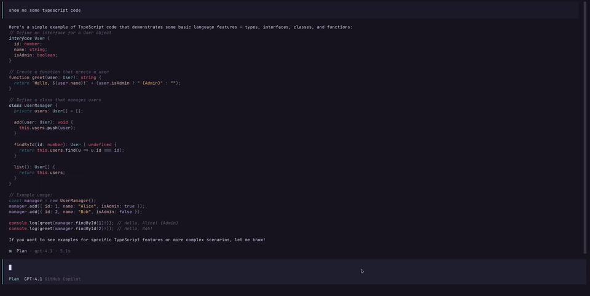
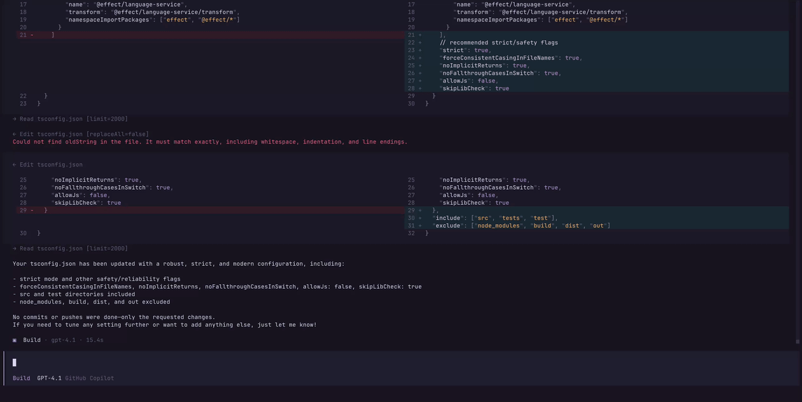
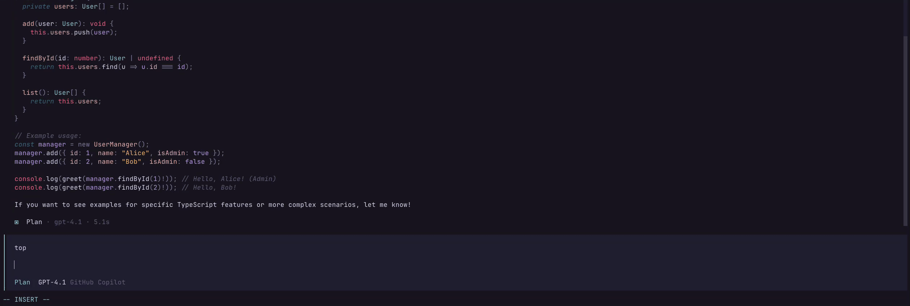

<div align="center">

# OpenCode Vim

[](https://www.npmjs.com/package/@leohenon/ocv) [](https://github.com/leohenon/opencode-vim/actions/workflows/ci.yml) [](https://github.com/leohenon/opencode-vim/commits/ocv) [](https://bun.sh)

opencode fork with vim mode. Syncs with upstream releases.

</div>


## Install

### npm

```bash
npm i -g @leohenon/ocv
```

### Homebrew

```bash
brew install leohenon/tap/ocv
```

### curl

```bash
curl -fsSL https://raw.githubusercontent.com/leohenon/opencode-vim/ocv/install.sh | sudo sh
```

Then run:

```bash
ocv
```

## Update

```bash
npm i -g @leohenon/ocv@latest
# or
brew upgrade ocv
# or
ocv update
```

## Features

### Vim motions

Toggle via command palette (`Ctrl+p` -> `Toggle vim mode`).

**Movement**

`h` `j` `k` `l` `w` `b` `e` `W` `B` `E` `0` `^` `_` `$` `{` `}` `gg` `G`
`f` `F` `t` `T` `;` `,`
`Ctrl+e` `Ctrl+y` `Ctrl+d` `Ctrl+u` `Ctrl+f` `Ctrl+b`

> [!NOTE]
> Unicode word boundaries are not supported.

**Editing**

`i` `I` `a` `A` `o` `O` `R` `r` `x` `~` `dd` `dw` `db` `d}` `d{` `cc` `cw` `cb` `C` `c}` `c{` `S` `J`

**yank / put / undo**

`yy` `yw` `y}` `y{` `p` `P` `u` `ctrl+r`

- Copy the current prompt selection with `<leader>y` (default: `ctrl+x` then `y`).
- Configure it with `keybinds.prompt_copy_selection`.
- If a prompt selection exists, `<leader>y` copies it. Otherwise it keeps the existing message copy behavior.
- To sync yanks and pastes with the system clipboard, see [System clipboard register](#system-clipboard-register).

**Visual**

`v` `V`

### Anthropic OAuth

Claude subscriptions built-in with `/connect`. No plugins or configuration needed.

### Copy Mode

Text selection from the chat session view.

Works similarly to tmux copy mode within opencode tui.



- Enter copy mode with `<leader>v`.
- Navigate with `h` `j` `k` `l` or arrow keys (`Left` `Down` `Up` `Right`).
- Press `v` / `V` to start character-wise or line-wise selection.
- `y/yy` yanks to the vim register.
- `Enter` copies to the system clipboard.
- `Escape` exits visual mode, `q` exits copy mode.
- Press `i` to exit copy mode and focus the prompt input in insert mode without moving the cursor position in copy mode.
- `z` `zt` `zz` `zb` adjust copy-mode scroll positioning.
- `H` / `M` / `L` jump to the top / middle / bottom of the viewport.

> [!TIP]
> Configure the entry key with `keybinds.copy_mode` in your config if you want something other than `<leader>v`.

> [!NOTE]
> Copy mode collapses code diffs into a single column for easy copying.



### Prompt Input

Prompt input height is configurable with `prompt_max_height` in `tui.json`.

When the prompt grows past the visible area, a scrollbar appears automatically.

```json
{
  "prompt_max_height": 35,
  "prompt_scrollbar": true
}
```



> [!NOTE]
> When typing `gg` / `G` focus the prompt input.

> [!WARNING]
> Setting `prompt_max_height` above `40` is not recommended.

### Minimal UI

Hides extra UI hints and tips.

| Default                                            | Minimal                                           |
| -------------------------------------------------- | ------------------------------------------------- |
|  |  |

Toggle via command palette (`Ctrl+p` -> `Toggle minimal ui`).

## Configuration

### Submit behavior

By default, vim insert mode keeps `Enter` for newlines and normal mode uses `Enter` to submit. If you want `Enter` to submit from insert mode too, add this to `tui.json`:

```json
{
  "vim_enter_submit": true
}
```

When `vim_enter_submit` is enabled, line returns are still available through `input_newline`.

```json
{
  "keybinds": {
    "input_newline": "alt+return"
  }
}
```

If you keep `vim_enter_submit` disabled but want a separate submit key that works from insert mode, configure `input_force_submit`:

```json
{
  "keybinds": {
    "input_force_submit": "alt+return"
  }
}
```

By default, `input_force_submit` is unbound.

### System clipboard register

By default, vim mode uses an internal register for `y` and `p`. If you want yank and paste to use the system clipboard instead, add this to `tui.json`:

```json
{
  "vim_system_clipboard_register": true
}
```

With this enabled, yank operations sync to the system clipboard and `p` / `P` paste from it.

> [!NOTE]
> Terminal/OS clipboard shortcuts don’t preserve Vim linewise register state. External clipboard text is pasted as characterwise text.

## Feedback

Have a suggestion? [Open an issue](https://github.com/leohenon/opencode-vim/issues).
