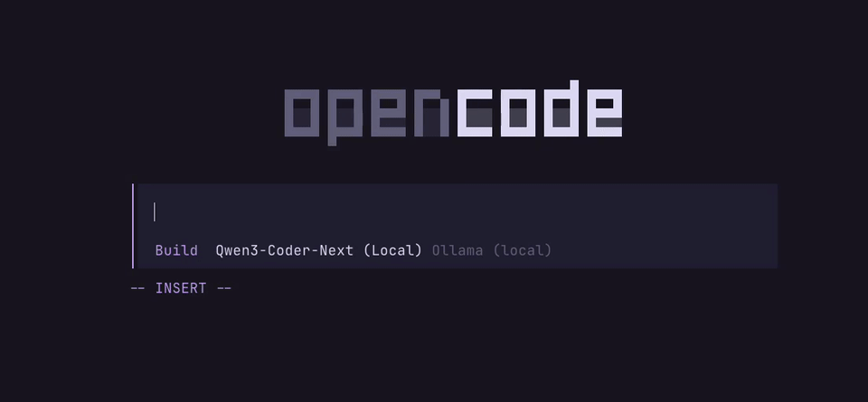
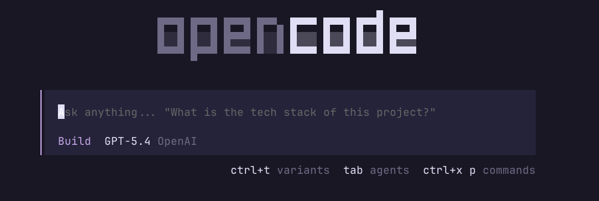
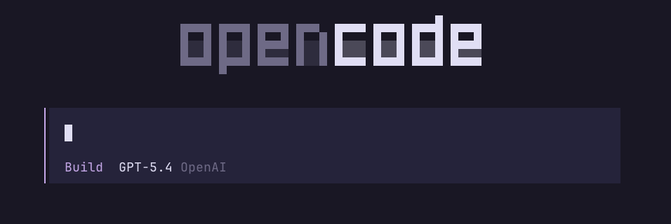

<div align="center">

# `Opencode Vim`

[](https://www.npmjs.com/package/@leohenon/ocv) [](https://github.com/leohenon/opencode/actions/workflows/ci.yml) [](https://github.com/leohenon/opencode/releases) [](https://bun.sh)

opencode fork with vim mode. Syncs with upstream releases.

</div>



## Install

### npm

```bash
npm i -g @leohenon/ocv
```

### Homebrew

```bash
brew install leohenon/tap/ocv
```

### curl

```bash
curl -fsSL https://raw.githubusercontent.com/leohenon/opencode/vim/install.sh | sudo sh
```

Then run:

```bash
ocv
```

## Update

```bash
npm i -g @leohenon/ocv@latest
# or
brew upgrade ocv
# or
ocv update
```

## Features

### Vim motions

`h` `j` `k` `l` `w` `b` `e` `W` `B` `E` `0` `^` `_` `$` `gg` `G`
`i` `I` `a` `A` `o` `O` `R` `x` `dd` `dw` `cc` `cw` `S` `J` `yy` `yw` `p` `P` `v` `V`
`f` `F` `t` `T` `;` `,`
`Ctrl+e` `Ctrl+y` `Ctrl+d` `Ctrl+u` `Ctrl+f` `Ctrl+b`

> [!TIP]
> Toggle via command palette (`Ctrl+p` -> `Toggle vim mode`).

### Anthropic OAuth

Claude subscriptions built-in with `/connect`. No plugins or configuration needed.

### Minimal UI

Hides extra UI hints and tips.

| Default                                            | Minimal                                           |
| -------------------------------------------------- | ------------------------------------------------- |
|  |  |

> [!TIP]
> Toggle via command palette (`Ctrl+p` -> `Toggle minimal ui`).

## Feedback

Have a suggestion? [Open an issue](https://github.com/leohenon/opencode/issues).
